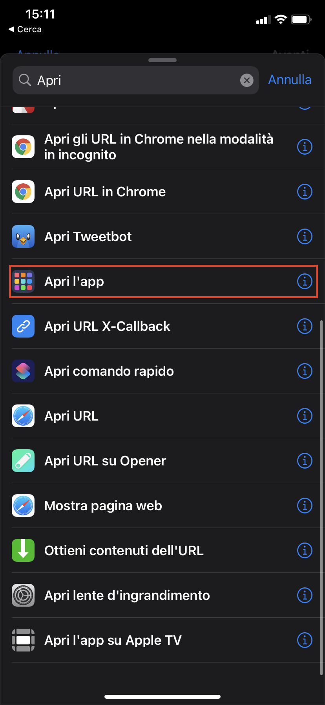

# Thallix UX Icon Pack

Pacote de ícones de uso livre, desenvolvido no Adobe XD especialmente para o iOS 14

#
## Como aplicar os ícones? (iOS)

Os ícones podem ser aplicados no iOS por meio de provisioning profile, baixado no site 22Over7 ou usando o aplicativo "Atalhos" (anteriormente chamado de Siri Shortcuts)

### Método 1 - 22Over7

- Baixe a pasta de ícones desse repositório.
- Abra seu navegador (no próprio iPhone ou no seu computador). Caso deseje prosseguir pelo iPhone, transfira a pasta de ícones para ele e salve as imagens na galeria. Navegue até https://iostheme.live
- Na página seguinte, selecione "Try Now"

- Depois disso, pesquise pelo app que deseja aplicar o ícone, na seção "Search for an app". Selecione o app nos resultados de pesquisa, na seção "Select one". Defina qual a label (nome do aplicativo) aparecerá na tela inicial em "New Label"

- Selecione o ícone clicando no quadrado pontilhado (ou arrastando e soltando, caso esteja em um computador). Após isso, clique em "Add icon". O ícone aparecerá no preview.

- Repita a operação para os outros apps que queira adicionar

Caso o app que queira adicionar seja algum do sistema (como telefone, notas, etc), selecione a aba "System app", selecione o app na lista, e a partir desse ponto, o procedimento segue como anteriormente.

- Após concluir, baixe o perfil rolando até o botão "Download Theme"

- Caso esteja usando um computador, envie o perfil para o seu iPhone. Caso utilize o AirDrop, o perfil será reconhecido automaticamente.

- Siga as instruções mostradas abaixo do botão de download para instalar o perfil

### Remover os ícones
Para remover os ícones, basta desinstalar o perfil, indo até configurações > Geral > Perfil, selecionar o perfil e depois remover.

#
## Método 2 - Atalhos

- Transfira a pasta de imagens para o seu iPhone. Para facilitar o processo, salve as que irá usar na galeria (caso tenha transferido como arquivo no app de arquivos)

- No Spotlight (deslize o dedo pra baixo em qualquer tela da homescreen ou vá à primeira tela, onde fica a "today view") pesquise pelo app de atalhos (ou "Shortcuts")

- No app de atalhos, selecione o ícone de adicionar novo atalho

- Na tela seguinte, selecione o botão de adicionar nova ação

- Procure pela ação de "Abrir App"

- Dentro da ação, toque em "Escolher"

- Escolha o app que deseja adicionar

- Selecione os três pontinhos no topo da tela

- Selecione a opção "Adicionar à tela inicial"

- Toque no ícone do atalho, selecione e corte a imagem conforme desejar

- Toque na opção "Adicionar", no topo da tela

- Repita a mesma operação para todos os ícones que deseja adicionar

### Remover os ícones
Na tela inicial, mantenha o ícone que deseja remover pressionado por 3 a 5 segundos e selecione "Eliminar Atalho"

#
## Assets nesse repositório:
- Pacote de ícones
- Wallpaper
- Documento editável do Adobe XD, com alguns dos ícones do pacote
#
## Regras gerais:

- O uso pessoal e coorporativo desse pacote é livre. Pede-se somente que o autor do pacote seja creditado, referenciando este repositório caso seja possível
#
## Icon Requests:

Este pacote não é associado a nenhuma organização comercial, e portanto, não é beneficiado por nenhuma forma de monetização, não sendo desenvolvido em tempo integral. As requisições por novos ícones serão atendidas a depender do tempo livre do criador, e podem ser feitas através do e-mail thalleshenrique.na@gmail.com

